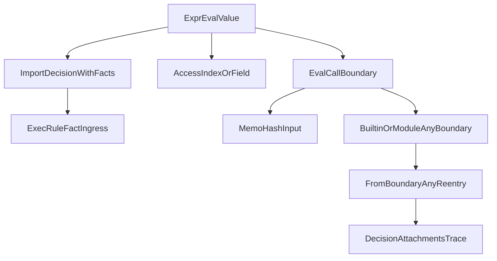

# Plan: Close Remaining Boxed Runtime Gaps

If merged, this pull request will close the final semantic and test-coverage gaps in the boxed `runtime.Value` migration, especially around import boundaries, map access behavior, and compatibility test depth.

## Remaining Problems To Fix

- `undefined` can still collapse to `null` in import `with` facts.
- Map-index fallback on unboxed maps can return `null` for missing keys instead of `undefined`.
- Coverage gate for `[/Users/binaek/sentrie/sentrie/runtime/value.go](/Users/binaek/sentrie/sentrie/runtime/value.go)` is no longer fully satisfied after boundary-conversion additions.
- Trace payload discipline is inconsistent in a few identifier paths.
- Compatibility tests exist but do not yet cover the full memoization/import boundary matrix requested by the migration plan.

## Scope

- Runtime boundary semantics:
  - `[/Users/binaek/sentrie/sentrie/runtime/imports.go](/Users/binaek/sentrie/sentrie/runtime/imports.go)`
  - `[/Users/binaek/sentrie/sentrie/runtime/executor.go](/Users/binaek/sentrie/sentrie/runtime/executor.go)`
  - `[/Users/binaek/sentrie/sentrie/runtime/eval_access.go](/Users/binaek/sentrie/sentrie/runtime/eval_access.go)`
- Value conversion + coverage:
  - `[/Users/binaek/sentrie/sentrie/runtime/value.go](/Users/binaek/sentrie/sentrie/runtime/value.go)`
  - `[/Users/binaek/sentrie/sentrie/runtime/value_test.go](/Users/binaek/sentrie/sentrie/runtime/value_test.go)`
- Trace consistency:
  - `[/Users/binaek/sentrie/sentrie/runtime/eval_ident.go](/Users/binaek/sentrie/sentrie/runtime/eval_ident.go)`
- Regression tests:
  - `[/Users/binaek/sentrie/sentrie/runtime/eval_call_test.go](/Users/binaek/sentrie/sentrie/runtime/eval_call_test.go)`
  - `[/Users/binaek/sentrie/sentrie/runtime/eval_access_test.go](/Users/binaek/sentrie/sentrie/runtime/eval_access_test.go)`
  - new import-path tests near runtime import execution (new file under `runtime/`)
- PR metadata:
  - `[/Users/binaek/sentrie/sentrie/PR_DESCRIPTION.md](/Users/binaek/sentrie/sentrie/PR_DESCRIPTION.md)`

## Execution Path Focus

## Implementation Steps

1. **Fix import `with` boundary semantics**
  - In `[/Users/binaek/sentrie/sentrie/runtime/imports.go](/Users/binaek/sentrie/sentrie/runtime/imports.go)`, replace `val.Any()` export with boundary-preserving conversion.
  - Ensure nested policy ingress path decodes boundary values exactly once, preserving `undefined` vs `null`.
  - Verify behavior against non-null fact validation in `[/Users/binaek/sentrie/sentrie/runtime/executor.go](/Users/binaek/sentrie/sentrie/runtime/executor.go)`.
2. **Fix unboxed map missing-key behavior in index access**
  - In `[/Users/binaek/sentrie/sentrie/runtime/eval_access.go](/Users/binaek/sentrie/sentrie/runtime/eval_access.go)`, use two-value lookup for `map[string]any` fallback.
  - Return `Undefined()` on missing keys to match boxed semantics.
3. **Restore `runtime/value.go` phase-gate coverage**
  - Add targeted tests in `[/Users/binaek/sentrie/sentrie/runtime/value_test.go](/Users/binaek/sentrie/sentrie/runtime/value_test.go)` for:
    - `ToBoundaryAny` nested `list`/`map` recursion,
    - undefined token propagation through nested structures,
    - non-undefined passthrough branches,
    - `FromBoundaryAny` symmetry on nested data.
  - Confirm file-level coverage for `runtime/value.go` satisfies the phase requirement.
4. **Make trace output discipline explicit and consistent**
  - In `[/Users/binaek/sentrie/sentrie/runtime/eval_ident.go](/Users/binaek/sentrie/sentrie/runtime/eval_ident.go)`, normalize `n.SetResult(...)` calls to explicitly use unboxed payloads where intended.
5. **Expand compatibility regression tests**
  - Extend `[/Users/binaek/sentrie/sentrie/runtime/eval_call_test.go](/Users/binaek/sentrie/sentrie/runtime/eval_call_test.go)` with:
    - map key-order variants,
    - nested list/map argument combinations,
    - numeric edge-case policy (if supported) for memoization stability.
  - Extend `[/Users/binaek/sentrie/sentrie/runtime/eval_access_test.go](/Users/binaek/sentrie/sentrie/runtime/eval_access_test.go)` with unboxed map missing-key assertions.
  - Add import-boundary tests (new runtime test file) for `with` values that evaluate to undefined and nested structures.
6. **Verification and stabilization**
  - Run focused suites first (`runtime` tests touching value/call/access/import), then broader runtime+cmd suites.
  - Check lints on all touched files.
  - Update `[/Users/binaek/sentrie/sentrie/PR_DESCRIPTION.md](/Users/binaek/sentrie/sentrie/PR_DESCRIPTION.md)` to include these final fixes and test evidence.

## Acceptance Criteria

- Import `with` execution preserves `undefined`/`null` distinction without spurious null-fact invocation failures.
- `map[string]any` missing-key index access returns `undefined`, not `null`.
- `[/Users/binaek/sentrie/sentrie/runtime/value.go](/Users/binaek/sentrie/sentrie/runtime/value.go)` coverage gate is re-satisfied.
- Trace result payload handling is consistent with migration boundary rules.
- Memoization and import boundary compatibility tests cover the agreed matrix and pass.
- No lint issues or regressions in runtime/cmd test suites.

