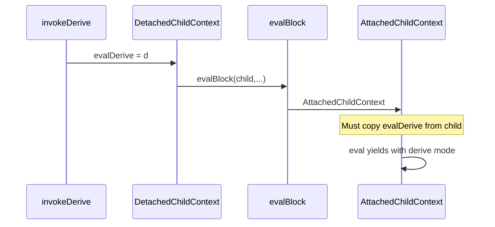

# PR #89 — Derive hardening (review baked in)

## Goal

Bring **runtime and index behavior** in line with the **locked derive feature plan** ([`.cursor/plans/derive_feature_88_e3809fda.plan.md`](.cursor/plans/derive_feature_88_e3809fda.plan.md)) and close the **purity / export / context** gaps identified in the PR #89 review. Work is ordered so **merge-blocking correctness** lands first, then **static purity**, then **structure / drift / tests**.

## Locked-plan alignment

The derive plan calls for (among other things):

- Detached derive evaluation with a **clear purity contract** (no policy rules, no TS, no impure builtins, no facts as trusted inputs).
- **Static** enforcement where possible (`index/validate.go` walker with scope stack).
- **Single source of truth** for which builtins are pure — **not** a second string list that can drift from [`runtime/builtins.go`](runtime/builtins.go).

The current branch implements **derive indexing + `detectDeriveCycle`** but **does not** implement the plan’s **purity walker** in `validate.go`. The review treats that as **Critical**: violations reach runtime and some succeed silently.

---

## Critical

### C1 — `evalDerive` dropped inside derive bodies (`AttachedChildContext`)

**Context:** [`runtime/derive_invoke.go`](runtime/derive_invoke.go) sets `evalDerive` on a **detached** context, then calls [`evalBlock`](runtime/eval_block.go) which does `ec = ec.AttachedChildContext()`. [`AttachedChildContext`](runtime/exec_ctx.go) copies `policy`, `modules`, `executor`, `refStack`, but **not** `evalDerive`.

**Effects:** [`runtime/eval_ident.go`](runtime/eval_ident.go) rule dispatch when `evalDerive == nil`; [`runtime/eval_call.go`](runtime/eval_call.go) define-site maps and builtin whitelist keyed off `ec.evalDerive` do not run inside the block.

**Fix:** In [`runtime/exec_ctx.go`](runtime/exec_ctx.go) `AttachedChildContext`, set `evalDerive` from the parent `ec` (same as other inherited fields). All `evalDerive` reads are direct field access (no parent walk) — grep confirms only `eval_call.go`, `eval_ident.go`, `derive_invoke.go`.

### C2 — Derive bodies can call **TypeScript / module** functions (`getTarget` fall-through)

**Context:** [`getTarget`](runtime/eval_call.go) gates **builtins** with `ec.evalDerive != nil` + `isBuiltinAllowedInDerive`, but the **`splitAliasFn` → `ec.Module` → `modulebinding.Call`** path has **no** derive check.

**Fix:** Immediately **before** `module, fn := splitAliasFn(calleeStr)`, if `ec.evalDerive != nil`, return a **specific error** (wording parallel to the existing builtin message: not permitted inside a derive / cannot call TS modules from a derive). Ensure no fall-through to module resolution.

### C3 — Cross-namespace **export** only on derive caller path

**Context:** [`lookupDeriveBySlashFQ`](runtime/eval_call.go): `VerifyDeriveExported` runs inside `ec.evalDerive != nil` branch; **`ResolveDerive`** path returns `d` with **no** export check — rules in `com/ex` can call `com/alpha/secret()` when `secret` is unexported.

**Fix:** After `d` is resolved (from **either** branch: `DefineFQN` / `DerivesByFQN` / `ResolveDerive`), apply one helper:

- Caller namespace FQN: `ec.evalDerive.Namespace.FQN.String()` if non-nil, else `p.Namespace.FQN.String()` (when `p` and `p.Namespace` non-nil).
- If caller FQN ≠ `d.Namespace.FQN.String()`, call `d.Namespace.VerifyDeriveExported(d.Name)` and propagate error.

This **hoists** export enforcement so it applies to **rule** and **derive** callers alike (subsumes duplicate logic in the derive-only branch).

### C4 — **Static purity walker** missing (plan: validate / purity)

**Context:** Plan requires a walker in [`index/validate.go`](index/validate.go): scope stack (including `let`), identifier rules, `CallExpression` resolution (TS vs derive vs pure builtins), **no callable returns**, etc. Branch only adds [`detectDeriveCycle`](index/derive_cycle.go).

**Runtime symptoms without walker (review):**

- Fact read in derive → [`GetFact`](runtime/exec_ctx.go) / parent chain returns **undefined** (silent), not a hard error.
- Callable return from derive — no compile-time rejection; add runtime guard in [`invokeDerive`](runtime/derive_invoke.go) if walker does not cover all yields.
- TS `alias.fn` — covered by **C2** at runtime; walker should **also** flag at index time where possible.

**Fix:** Implement the **purity walker** in `index/validate.go` (or a dedicated `index/derive_purity.go` if file size warrants — prefer co-location with existing validate passes unless file becomes unwieldy). Integrate into existing `validate` / `Validate` pipeline **after** programs are indexed so FQN / derive maps exist.

Walker should at minimum match review bullets:

- No **fact** reads by identifier (and align with runtime **explicit error** in Phase 2).
- No **TS module** calls (`alias.fn` pattern) — match parser/resolution conventions used elsewhere.
- Calls only **derive** (define-site / index rules you already use) or **pure** builtins — single source of truth once **Phase 3** lands (until then, consult `pure_builtins` / temporary bridge).
- No **callable** values flowing to yield (lambda / boxed callable).
- **`let`** scopes: inner `let` bindings must not violate closure rules the plan describes; add tests so future regressions fail in **index**, not only at runtime.

### C5 — Committed **`.cursor/plans/derive_feature_88_e3809fda.plan.md`** vs AGENTS.md

**Context:** [`AGENTS.md`](AGENTS.md) says **never commit `*.md`**. The plan file’s own delivery section references that. The file is on the branch diff.

**Fix:** **`git rm`** / revert the plan file from the branch before merge (do not replace with a committed substitute unless maintainers explicitly want `.cursor/plans/` on `main`).

---

## Warnings

### W1 — `pure_builtins.go` duplicates builtin names (plan section 2 drift hazard)

**Context:** [`runtime/pure_builtins.go`](runtime/pure_builtins.go) is a parallel string set from [`Builtins`](runtime/builtins.go).

**Fix:** Refactor registration to a **single** structure (e.g. `map[string]struct{ Fn Builtin; Pure bool }` or attach `Pure` at registration) so every new builtin **must** declare purity at the definition site; `isBuiltinAllowedInDerive` reads that flag. **Phase 3** after behavioral fixes stabilize.

### W2 — Fact reads in derive return **undefined** (confusing traces)

**Context:** [`DetachedChildContext`](runtime/exec_ctx.go) has no parent / no facts; reads degrade to undefined.

**Fix:** When `ec.evalDerive != nil`, **`GetFact`** (or early in [`eval_ident`](runtime/eval_ident.go) after local/let) returns a **clear error** (“facts are not available inside a derive” or similar). Walker (C4) catches static cases; runtime catches dynamic/leaks.

### W3 — **Test coverage** for purity boundary

Add fail-then-pass tests (see [Test recommendations](#test-recommendations)) for: TS module in derive; rule `ExecRule` cross-namespace unexported slash; callable return; fact identifier; internal `let` positive case; two-program define-site order.

### W4 — **Define-site** / multi-`AddProgram` ordering

**Context:** [`index/index.go`](index/index.go) `createPolicy` receives `cloneDeriveMap(ns.Derives)` at **policy index** time; namespace `derive` statements **after** that policy in the same file (or in a later program) can diverge from `DefineShort` snapshots.

**Fix (choose one and document):**

- **Test-lock** sequential `AddProgram` order + document for pack authors; or
- **Post-pass** refresh of define-site maps after all programs loaded (larger change).

### W5 — [`index/derive_cycle.go`](index/derive_cycle.go) `deriveCallees` `default:` is silent

New AST kinds → **missing edges** in cycle graph. Prefer a **visitor**, or `default` branch that **fails closed** in tests / `//go:debug` assert, or exhaustive switch with compiler help when possible.

### W6 — **Two-segment** FQN slash callee vs division

**Context:** [`getTarget`](runtime/eval_call.go) requires `len(parts) >= 3` for derive slash resolution; `namespace foo` + `derive bar` → FQN `foo/bar` is **two** segments and may parse as **division**. Spike covered `a/b` vs `com/example/ns/name`.

**Fix:** Either **document** as a known constraint (prefer deeper namespaces / use identifier `bar()`), or lower threshold / disambiguate when an indexed derive FQN exists (product decision).

---

## Suggestions (non-blocking)

- [`runtime/derive_invoke.go`](runtime/derive_invoke.go): `prev := child.evalDerive` / defer restore is redundant if child is always fresh — inline `child.evalDerive = d` if review’s micro-cleanup is desired.
- [`runtime/eval_call.go`](runtime/eval_call.go): optional micro-opt `strings.Count(fqn, sep)+1` vs `Split` for segment count only.
- [`parser/export_shape.go`](parser/export_shape.go): include `got %s` in export parse error.
- [`runtime/exec_ctx.go`](runtime/exec_ctx.go): extend doc on **why** `refStack` is cloned in `DetachedChildContext` (derive→derive cycle chain).
- Extend `evalDerive` field comment: sentinel for fact reads, TS calls, rule dispatch, impure builtin errors.
- [`index/derive.go`](index/derive.go): document **DefineShort / DefineFQN are bind-time snapshots, immutable**.
- [`runtime/derive_invoke.go`](runtime/derive_invoke.go): optional single-pass param walk.
- [`parser/derive_test.go`](parser/derive_test.go) or index policy test: `derive` before `fact` → `latePolicyHeaderErr` one-liner.
- Parser: typed lambda vs `tryReadLambdaSignature` consolidation — follow-up refactor only.

---

## Test recommendations

All should **fail before fixes**, **pass after**. Prefer `ExecRule` / `AddProgram` + `Validate` where the bug is integration-shaped.

| Case | Expected |
|------|-----------|
| Derive body `alias.fn(x)` (used module) | Clear TS/module-not-permitted error |
| Rule body `com/alpha/unexported()` slash | `NotExportedError` (extends existing getTarget-only test) |
| Derive yield `(x) => { yield x }` | Callable return rejected (index and/or runtime) |
| Derive references **fact** name | Explicit error, not undefined propagation |
| Derive `let doubled = x * 2; yield doubled + 1` | **Passes** purity (no false positive once walker exists) |
| Two programs same namespace: A=`helper`, B=`caller` calls `helper` | Success; **reverse order** documents expected behavior |

---

## Config follow-up

Add a **`.cursor/rules`** (or extend existing) entry, per review:

> When `ec.evalDerive != nil`, **every** resolution path in [`runtime/eval_call.go`](runtime/eval_call.go) and [`runtime/eval_ident.go`](runtime/eval_ident.go) must **explicitly** allow/deny derive context. Falling through to an existing path **without** a derive check is a bug.

This encodes the recurring pattern (builtin gated, module path missed).

---

## Safety deep-dive

Before merge, do a focused pass on:

- [`runtime/eval_call.go`](runtime/eval_call.go) — all `getTarget` branches after C1–C3.
- [`runtime/eval_ident.go`](runtime/eval_ident.go) — identifiers, facts, rules under derive.
- New **`index/validate.go` purity walker** — must align with runtime denylists so static and runtime never disagree on “allowed” in a way that confuses authors.

---

## Implementation phasing (recommended)

| Phase | Scope | Rationale |
|-------|--------|-----------|
| **1** | C1, C2, C3, C5 + targeted tests for C1–C3 | Merge blockers; small diff |
| **2** | C4 walker + W2 fact error + callable return guard + W3 tests | Contract enforcement |
| **3** | W1 builtins refactor + W4/W5/W6 + Suggestions | Drift / ergonomics / follow-ups |

---

## Files touched (expected)

- [`runtime/exec_ctx.go`](runtime/exec_ctx.go) — `AttachedChildContext`, docs, `GetFact` / fact path
- [`runtime/eval_call.go`](runtime/eval_call.go) — `getTarget`, `lookupDeriveBySlashFQ` refactor, module guard
- [`runtime/eval_ident.go`](runtime/eval_ident.go) — optional fact error coordination
- [`runtime/derive_invoke.go`](runtime/derive_invoke.go) — callable return check if needed
- [`index/validate.go`](index/validate.go) (+ possibly new `index/derive_purity.go`) — walker
- [`index/derive_cycle.go`](index/derive_cycle.go) — optional visitor / default handling
- [`runtime/builtins.go`](runtime/builtins.go) + [`runtime/pure_builtins.go`](runtime/pure_builtins.go) — Phase 3 single source
- Tests: [`runtime/eval_derive_test.go`](runtime/eval_derive_test.go), [`index/derive_test.go`](index/derive_test.go), [`parser/derive_test.go`](parser/derive_test.go)
- **Remove:** [`.cursor/plans/derive_feature_88_e3809fda.plan.md`](.cursor/plans/derive_feature_88_e3809fda.plan.md) from git

---

## PR follow-up

After implementation, update PR #89 (or a follow-up PR) description and reply to review threads: which **Critical** items are fixed, pointer to new tests, and note **Phase 2/3** if split across PRs.
