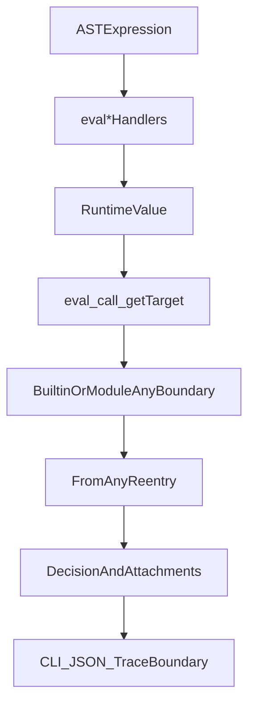

# Follow-up Plan: Boxed Runtime Migration Gaps

If merged, this pull request will complete the boxed `runtime.Value` migration by restoring semantic parity at evaluator boundaries and locking behavior with targeted regression tests.

## Objectives

- Fix correctness regressions around `undefined` vs `null` in call/access/type-validation paths.
- Enforce a single normalization discipline for type-ref validation.
- Add compatibility tests for memoization keys and boundary behavior.
- Ensure CLI attachment rendering remains recursive with boxed values.

## Scope and File Targets

- Runtime evaluator core:
  - `[/Users/binaek/sentrie/sentrie/runtime/eval_ident.go](/Users/binaek/sentrie/sentrie/runtime/eval_ident.go)`
  - `[/Users/binaek/sentrie/sentrie/runtime/eval_call.go](/Users/binaek/sentrie/sentrie/runtime/eval_call.go)`
  - `[/Users/binaek/sentrie/sentrie/runtime/eval_access.go](/Users/binaek/sentrie/sentrie/runtime/eval_access.go)`
- Type-ref validation funnel:
  - `[/Users/binaek/sentrie/sentrie/runtime/typeref.go](/Users/binaek/sentrie/sentrie/runtime/typeref.go)`
  - `[/Users/binaek/sentrie/sentrie/runtime/typeref_list.go](/Users/binaek/sentrie/sentrie/runtime/typeref_list.go)`
  - `[/Users/binaek/sentrie/sentrie/runtime/typeref_map.go](/Users/binaek/sentrie/sentrie/runtime/typeref_map.go)`
  - `[/Users/binaek/sentrie/sentrie/runtime/typeref_document.go](/Users/binaek/sentrie/sentrie/runtime/typeref_document.go)`
  - `[/Users/binaek/sentrie/sentrie/runtime/typeref_shape.go](/Users/binaek/sentrie/sentrie/runtime/typeref_shape.go)`
- CLI compatibility:
  - `[/Users/binaek/sentrie/sentrie/cmd/exec.go](/Users/binaek/sentrie/sentrie/cmd/exec.go)`
- Tests (new and/or updated):
  - `[/Users/binaek/sentrie/sentrie/runtime/eval_distinct_test.go](/Users/binaek/sentrie/sentrie/runtime/eval_distinct_test.go)`
  - call-path test file to add (for `eval_call`)
  - typeref-related tests under `[/Users/binaek/sentrie/sentrie/runtime](/Users/binaek/sentrie/sentrie/runtime)`

## Execution Path Focus

## Implementation Steps

1. **Fix typed `let` validation input shape**
  - In `evalIdent`, ensure type validation receives normalized data expected by validators.
  - Preferred approach: normalize at validator entry (single funnel), not ad hoc at each callsite.
2. **Preserve `undefined` semantics at call boundaries**
  - In `eval_call` target wrappers, avoid ambiguous `Any()` conversion when transporting arguments that may be `undefined`.
  - Introduce an explicit boundary encoding strategy for `undefined` in builtin/module invocation, and decode consistently on re-entry.
3. **Restore boxed traversal in field/index access**
  - In `accessField` and `accessIndex`, first operate on `MapValue`/`ListValue` to preserve boxed nested states.
  - Keep object/map fallback logic for compatibility, but do not lose `undefined` during traversal.
4. **Implement one normalization funnel for typeref validators**
  - Centralize normalization in `validateValueAgainstTypeRef` (or one helper it calls).
  - Keep validators free from scattered boxed/unboxed assumptions; eliminate mixed input expectations where practical.
5. **Lock memoization compatibility policy**
  - Define expected behavior for hash keys involving `undefined` vs `null`, nested lists/maps, and map key-order.
  - Implement tests that capture and freeze chosen policy.
6. **Fix CLI recursive formatting for boxed attachments**
  - Extend attachment formatter to recurse through boxed `runtime.Value` containers as well as legacy `any` containers.
  - Confirm parity in table output for nested list/map attachments.
7. **Stabilize and verify**
  - Add/extend tests for:
    - typed `let` + typeref validation with boxed values,
    - builtin/module boundary behavior for `undefined`/`null`,
    - access semantics on nested containers with boxed unknowns,
    - memoized call key compatibility,
    - CLI attachment rendering recursion.
  - Run targeted runtime + CLI tests first, then broader suite.
8. **Update PR metadata**
  - Refresh `[/Users/binaek/sentrie/sentrie/PR_DESCRIPTION.md](/Users/binaek/sentrie/sentrie/PR_DESCRIPTION.md)` to describe these follow-up fixes, review focus, testing, and dependency status.

## Acceptance Criteria

- `undefined` and `null` remain intentionally distinct through evaluator internal paths.
- Typed `let` declarations validate correctly with boxed runtime values.
- Access/call paths do not silently coerce nested `undefined` to `null`.
- Memoization behavior is explicitly tested and documented.
- CLI attachment output preserves recursive structure for boxed values.
- No new lint/test regressions in touched runtime/CLI areas.

