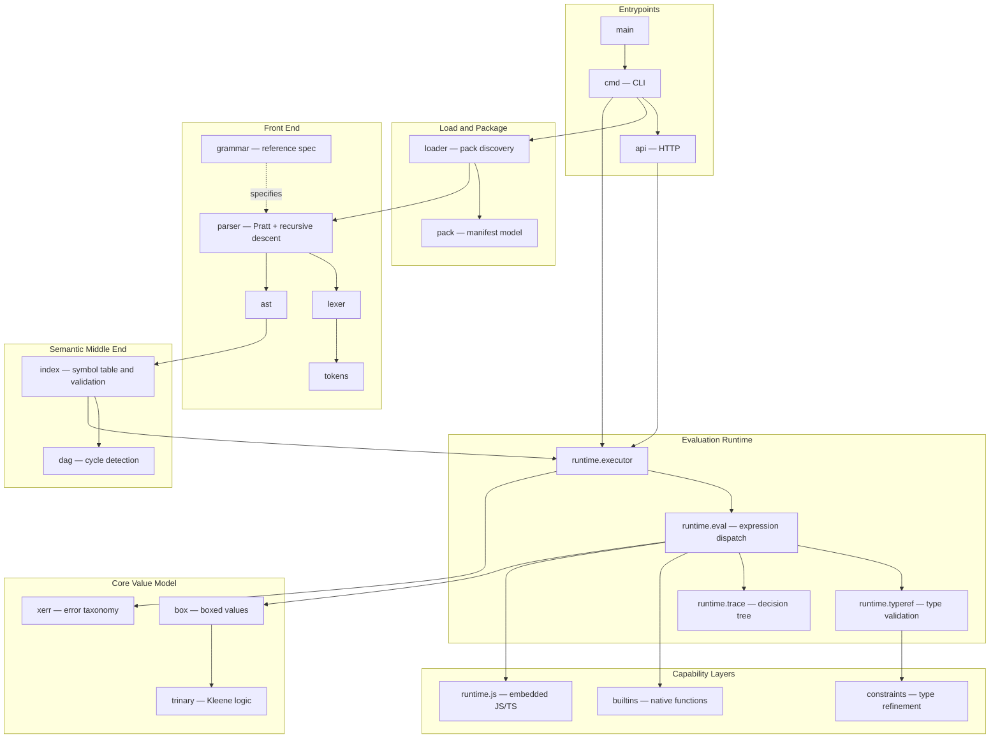

# Sentrie — Knowledge Graph Entrypoint Matrix

Sentrie is an extensible policy evaluation engine. A policy pack is loaded from disk, parsed into an AST, indexed into a validated semantic model, and evaluated against caller-supplied facts to produce a three-valued decision — `True`, `False`, or `Unknown`.

This directory is the machine-readable index of that system. Every node file follows a fixed schema: identity front-matter, architectural role, a graph-edge table using a closed predicate set, interface contracts, and operational gotchas. Start here, follow the wiki-links.

## System Overview

### Reading Order for a New Agent

1. **Value model first** — [[box]], [[trinary]], [[box.value]]. Nothing else makes sense without knowing that every value is boxed and that logic is three-valued.
2. **Pipeline shape** — [[lexer]], [[parser]], [[ast]], [[index.package]], [[runtime]]. Five stages, strictly ordered.
3. **Where the risk lives** — [[runtime.executor]], [[runtime.exec_ctx]], [[runtime.modules]], [[api.handle_decision]]. Concurrency, foreign code execution, and the network boundary.

---

## Node Catalog

### System / Package

- [[api]] — HTTP service layer
- [[api.middleware]] — request middleware chain
- [[ast]] — abstract syntax tree definitions
- [[box]] — universal boxed value type
- [[builtins]] — native function registry
- [[cmd]] — command-line interface
- [[constants]] — shared constant definitions
- [[constraints]] — type refinement predicates
- [[dag]] — directed acyclic graph and cycle detection
- [[ext.dependencies]] — third-party dependency manifest
- [[grammar]] — reference grammar specification
- [[index.package]] — semantic model, symbol table, validation
- [[lexer]] — lexical analysis
- [[loader]] — pack discovery and program loading
- [[pack]] — pack manifest model and permissions
- [[parser]] — Pratt and recursive-descent parser
- [[runtime]] — policy evaluation engine
- [[runtime.js]] — embedded JavaScript subsystem
- [[runtime.js.builtins]] — Go-backed JavaScript standard library
- [[runtime.trace]] — decision trace tree
- [[tokens]] — token kinds and source ranges
- [[trinary]] — Kleene three-valued logic
- [[version]] — build and version information
- [[xerr]] — structured error taxonomy

### Class

- [[api.http]] — HTTP server lifecycle and routing
- [[api.problem_details]] — RFC 9457 error format
- [[ast.node]] — base node interfaces
- [[ast.typeref]] — type reference hierarchy
- [[box.value]] — the boxed value implementation
- [[index.derive]] — derive semantic model
- [[index.index]] — the root index type
- [[index.namespace]] — namespace scope and exports
- [[index.policy]] — policy semantic model
- [[index.program]] — per-file inventory
- [[index.rule]] — rule semantic model
- [[index.shape]] — shape composition and hydration
- [[parser.parser]] — parser state and driver
- [[parser.program]] — top-level program assembly
- [[runtime.builtin_call]] — the builtin `Env` adapter
- [[runtime.callable]] — lambda and derive callable interface
- [[runtime.decision]] — the decision output contract
- [[runtime.exec_ctx]] — per-execution scope chain
- [[runtime.executor]] — top-level execution driver
- [[runtime.js.alias_runtime]] — CommonJS VM host
- [[runtime.js.registry]] — module resolution and compilation
- [[runtime.modules]] — JavaScript module binding and VM pooling

### Function / Endpoint

- [[api.handle_decision]] — `POST /decision`
- [[index.builtin_check]] — static builtin call validation
- [[index.commit]] — index finalisation
- [[index.derive_cycle]] — derive cycle detection
- [[index.derive_expr_walk]] — derive expression traversal
- [[index.derive_purity]] — derive purity enforcement
- [[index.resolve]] — symbol resolution
- [[index.segments]] — path segment resolution
- [[index.validate]] — whole-index validation
- [[parser.call]] — call expression parsing
- [[parser.cast]] — cast expression parsing
- [[parser.comment]] — comment statement parsing
- [[parser.derive]] — derive declaration parsing
- [[parser.export_rule]] — rule export parsing
- [[parser.export_shape]] — shape export parsing
- [[parser.expression]] — Pratt expression driver
- [[parser.fact]] — fact declaration parsing
- [[parser.fqn]] — fully-qualified name parsing
- [[parser.infix]] — infix operator parsing
- [[parser.is]] — `is` expression parsing
- [[parser.lambda]] — lambda literal parsing
- [[parser.left_curly]] — brace disambiguation
- [[parser.let]] — let declaration parsing
- [[parser.namespace]] — namespace statement parsing
- [[parser.not]] — negated infix parsing
- [[parser.parse]] — parse entry point
- [[parser.policy]] — policy block parsing
- [[parser.rule]] — rule declaration parsing
- [[parser.shape]] — shape declaration parsing
- [[parser.statement]] — statement dispatch
- [[parser.ternary]] — ternary and Elvis parsing
- [[parser.transform]] — transform expression parsing
- [[parser.typed_lambda]] — typed lambda parsing
- [[parser.unary]] — prefix operator parsing
- [[parser.use]] — `use` statement parsing
- [[runtime.derive_invoke]] — derive invocation in a pure context
- [[runtime.eval]] — central expression dispatch
- [[runtime.eval_access]] — field and index access
- [[runtime.eval_block]] — block expression evaluation
- [[runtime.eval_call]] — call dispatch and memoization
- [[runtime.eval_cast]] — type cast evaluation
- [[runtime.eval_ident]] — identifier resolution
- [[runtime.eval_infix]] — binary operators
- [[runtime.eval_lambda]] — closure creation
- [[runtime.eval_ternary]] — conditional and Elvis
- [[runtime.eval_transform]] — transform (unimplemented)
- [[runtime.eval_unary]] — prefix operators
- [[runtime.imports]] — cross-policy decision imports
- [[runtime.typeref]] — type validation dispatcher
- [[runtime.typeref_dict]] — dict validation
- [[runtime.typeref_document]] — document validation
- [[runtime.typeref_list]] — list validation
- [[runtime.typeref_number]] — number validation
- [[runtime.typeref_record]] — record validation
- [[runtime.typeref_shape]] — shape validation
- [[runtime.typeref_string]] — string validation
- [[runtime.typeref_trinary]] — trinary validation

### Module / File

- [[api.net]] — listen address resolution
- [[index.builtin_kind]] — builtin kind inference
- [[index.policy_stmt]] — policy statement indexing
- [[main]] — process entrypoint
- [[parser.access]] — access expression parsing
- [[parser.block]] — block expression parsing
- [[parser.collection]] — list and dict literal parsing
- [[parser.err]] — parser error accumulation
- [[parser.import]] — import statement parsing
- [[parser.literal]] — literal parsing
- [[parser.lookups]] — prefix/infix handler registration
- [[parser.pipeline]] — pipeline operator desugaring
- [[parser.policy_metadata]] — policy metadata parsing
- [[parser.precedence]] — operator precedence table
- [[parser.primary]] — primary expression parsing
- [[parser.typeref]] — type reference parsing
- [[runtime.err_typedef]] — type validation error types
- [[runtime.js.stdlib]] — VM global installation
- [[runtime.js.tscompile]] — TypeScript transpilation

---

## Cross-Cutting Notes

**Where correctness risk concentrates.** [[runtime.executor]] and [[runtime.exec_ctx]] carry the concurrency; [[runtime.modules]] and [[runtime.js]] execute foreign code; [[api.handle_decision]] is the unauthenticated network boundary. Changes in those four areas warrant the most scrutiny.

**Where the language is stricter than it looks.** Logical operators do not short-circuit ([[runtime.eval_infix]]), shapes accept undeclared fields ([[runtime.typeref_shape]]), and casts do not currently enforce their target type ([[runtime.eval_cast]]).

**Where the language is looser than it looks.** Constraint names are not validated until a decision is requested ([[constraints]]), and `transform` parses but is unimplemented ([[runtime.eval_transform]]).

**Static and dynamic checks are paired.** [[index.builtin_check]] mirrors [[runtime.eval_call]], and [[index.derive_purity]] mirrors the runtime purity gates. When changing one, check the other — they are designed to agree and can silently drift.
