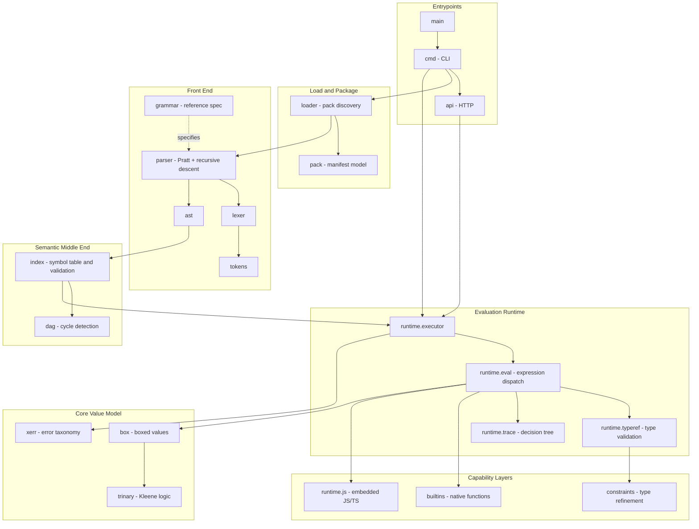

# Sentrie - Knowledge Graph Entrypoint Matrix

Sentrie is an extensible policy evaluation engine. A policy pack is loaded from disk, parsed into an AST, indexed into a validated semantic model, and evaluated against caller-supplied facts to produce a three-valued decision - `True`, `False`, or `Unknown`.

This file is the machine-readable index of that system. Every node file follows a fixed schema: identity front-matter, architectural role, a graph-edge table using a closed predicate set, interface contracts, and operational gotchas. Start here, follow the wiki-links.

The catalog lives here, as `overview.md`, so that the Go package `index/` can own `index.md` like every other package owns its own name.

The schema below is normative and is enforced by `make docs-graph` (and by the `docs-graph` CI job). A change that violates it fails the build.

---

## Graph Schema

### Extractor contract

An edge is a `[[target]]` wiki-link or a backticked leaf id appearing in the **Target (Object)** column of a section-2 table. Subject and predicate cells must also be wiki-linked or backticked - a bare `CALLS` is not a predicate. Consumers **must** be markdown-aware:

- `[[…]]` inside a code span or a fenced code block is **not** an edge. It is literal text. `api.net` legitimately documents the string `[[::1]]:7529`, which is the malformed output of `net.JoinHostPort` - not a reference to a node called `::1`.
- Wiki-links outside section 2 are navigational cross-references, not edges.

A naive `\[\[([^\]]+)\]\]` scan over the raw bytes will produce false edges. Strip code spans first.

### Required front-matter

Every node file carries exactly these five keys:

| Key | Value |
| :--- | :--- |
| `id` | Must equal the filename stem. |
| `type` | One of the five node types below. |
| `language` | `Go`, `EBNF`, or `N/A`. |
| `file_path` | A path, glob, or comma-separated list of either, each of which must match at least one file. `Infrastructure` nodes have no source file and use the literal `(external)`. |
| `tags` | Comma-separated, free-form. |

### Node types

| Type | Meaning |
| :--- | :--- |
| `System / Package` | A Go package or a whole subsystem. |
| `Class` | A struct or interface with meaningful behaviour. |
| `Function / Endpoint` | A function, method group, or HTTP endpoint. |
| `Module / File` | A source file whose contents do not warrant a class node. |
| `Infrastructure` | A resource outside the process: filesystem, environment, sockets, build metadata. |

### Predicates (closed set)

| Predicate | Meaning | Target constraint |
| :--- | :--- | :--- |
| `CALLS` | Subject invokes a function or method on the target. | any |
| `IMPORTS` | Subject imports the target **library**. | leaves only |
| `LAYERED_ON` | Subject is a subsystem built on top of the target subsystem. | package to package |
| `DEPENDS_ON` | Subject consumes the target's types, contracts, or declarations, with no layering implied. | nodes only |
| `READS_FROM` | Subject reads state or data owned by the target. | any |
| `MUTATES` | Subject writes state owned by the target. | any |
| `INHERITS_FROM` | Subject implements or embeds the target's interface. | nodes only |

No other predicate may appear.

**`LAYERED_ON` versus `DEPENDS_ON`.** Layering is a property of *subsystems*, so `LAYERED_ON` is restricted to edges between two `System / Package` nodes. That restriction is the point: it keeps the layer map to around eighty edges, small enough to read as an architecture diagram, instead of re-absorbing every type reference in the codebase. `DEPENDS_ON` covers the rest - a file consuming an AST type, a validator consuming a shape model, and conformance relationships like [[parser]] to [[grammar]], which is a specification rather than a layer.

To answer "what sits beneath X", read X's `LAYERED_ON` edges. To answer "what would break if I change this type", read the `DEPENDS_ON` edges pointing at it.

A predicate asserts a relationship that exists. Contrasts, fallbacks, and deliberate **non**-relationships belong in section 1 or section 4 - not in the table with a parenthesised pseudo-predicate.

### Id namespaces

| Namespace | Form | Linked as | Has a file |
| :--- | :--- | :--- | :--- |
| Internal | `<pkg>` or `<pkg>.<symbol>` | `[[wiki-link]]` | yes |
| Catalog | `overview` | this file | yes |
| Infrastructure | `infra.<resource>` | `[[wiki-link]]` | yes |
| Third-party | `ext.<org>.<module>` | backticks | no |
| Standard library | `std.<import/path>` | backticks | no |

A `System / Package` node's `id` is its `file_path` with slashes turned into dots: `index/` is `index`, `runtime/js/` is `runtime.js`. The Go package name and the node id are the same string. Globs (`runtime/js/builtin_*.go`) and non-directory paths (`go.mod`) are the exceptions, and they still prefix-match the directory they live in.

`ext.*` ids are derived from the `go.mod` module path: host organisation, then module name, lowercased, `/v2`-style major suffixes dropped. `github.com/Masterminds/semver/v3` is therefore `ext.masterminds.semver` - never `ext.semver`. `std.*` ids keep the import path verbatim, so `std.encoding/json`, not `std.encoding_json`.

**External references are backticked leaves, never wiki-links.** They have no node file and a `[[…]]` around one is a broken link by definition. The single exception is [[ext.dependencies]], which is the *catalog* node describing the manifest as a whole - it is a real node, and the individual libraries it catalogues are leaves.

### Edge locality

Every edge in a node's table has that node - or one of its namespace members, for package nodes - at one end. A node does not declare edges between two unrelated third parties.

Full reciprocity is deliberately **not** required. Hub nodes such as [[ast]] have well over a hundred inbound edges and summarise them rather than enumerating them; forcing symmetry would make those files unreadable. The invariant that replaces it is locality plus **no orphans**: every node has at least one inbound link from somewhere, so nothing is unreachable from this entrypoint.

A corollary worth internalising: a node's table is not a complete inbound index. To find every caller of a hub, traverse from the callers, not from the hub.

### Enforcement

`go test ./internal/docsgraph/` asserts all of the above - front-matter shape, `id`/filename agreement, package ids matching their directory `file_path`, `file_path` resolution, the closed predicate set, link resolution, locality, orphans, and catalog completeness. It runs in CI as the `docs-graph` job. A change that violates the schema fails the build rather than being caught in review.

### Known limitation

- **Nothing detects prose drift.** The checks above verify structure, not truth: a node whose source is rewritten still passes as long as the path resolves. [#121](https://github.com/sentrie-sh/sentrie/issues/121) proposes source fingerprints. Treat specific behavioural claims as accurate-as-of-writing and verify against source before relying on one.

---

## System Overview

### Reading Order for a New Agent

1. **Value model first** - [[box]], [[trinary]], [[box.value]]. Nothing else makes sense without knowing that every value is boxed and that logic is three-valued.
2. **Pipeline shape** - [[lexer]], [[parser]], [[ast]], [[index]], [[runtime]]. Five stages, strictly ordered.
3. **Where the risk lives** - [[runtime.executor]], [[runtime.exec_ctx]], [[runtime.modules]], [[api.handle_decision]]. Concurrency, foreign code execution, and the network boundary.

---

## Node Catalog

### System / Package

- [[api]] - HTTP service layer
- [[api.middleware]] - request middleware chain
- [[ast]] - abstract syntax tree definitions
- [[box]] - universal boxed value type
- [[builtins]] - native function registry
- [[cmd]] - command-line interface
- [[constants]] - shared constant definitions
- [[constraints]] - type refinement predicates
- [[dag]] - directed acyclic graph and cycle detection
- [[ext.dependencies]] - third-party dependency manifest
- [[grammar]] - reference grammar specification
- [[index]] - semantic model, symbol table, validation
- [[lexer]] - lexical analysis
- [[loader]] - pack discovery and program loading
- [[pack]] - pack manifest model and permissions
- [[parser]] - Pratt and recursive-descent parser
- [[runtime]] - policy evaluation engine
- [[runtime.js]] - embedded JavaScript subsystem
- [[runtime.js.builtins]] - Go-backed JavaScript standard library
- [[runtime.trace]] - decision trace tree
- [[tokens]] - token kinds and source ranges
- [[trinary]] - Kleene three-valued logic
- [[version]] - build and version information
- [[xerr]] - structured error taxonomy

### Infrastructure

- [[infra.build_metadata]] - Go toolchain build info
- [[infra.filesystem]] - host storage boundary
- [[infra.network_sockets]] - inbound TCP listeners
- [[infra.os_environment]] - process environment variables

### Class

- [[api.http]] - HTTP server lifecycle and routing
- [[api.problem_details]] - RFC 9457 error format
- [[ast.node]] - base node interfaces
- [[ast.typeref]] - type reference hierarchy
- [[box.value]] - the boxed value implementation
- [[index.derive]] - derive semantic model
- [[index.index]] - the root index type
- [[index.namespace]] - namespace scope and exports
- [[index.policy]] - policy semantic model
- [[index.program]] - per-file inventory
- [[index.rule]] - rule semantic model
- [[index.shape]] - shape composition and hydration
- [[parser.parser]] - parser state and driver
- [[parser.program]] - top-level program assembly
- [[runtime.builtin_call]] - the builtin `Env` adapter
- [[runtime.callable]] - lambda and derive callable interface
- [[runtime.decision]] - the decision output contract
- [[runtime.exec_ctx]] - per-execution scope chain
- [[runtime.executor]] - top-level execution driver
- [[runtime.js.alias_runtime]] - CommonJS VM host
- [[runtime.js.registry]] - module resolution and compilation
- [[runtime.modules]] - JavaScript module binding and VM pooling

### Function / Endpoint

- [[api.handle_decision]] - `POST /decision`
- [[index.builtin_check]] - static builtin call validation
- [[index.commit]] - index finalisation
- [[index.derive_cycle]] - derive cycle detection
- [[index.derive_expr_walk]] - derive expression traversal
- [[index.derive_purity]] - derive purity enforcement
- [[index.resolve]] - symbol resolution
- [[index.segments]] - path segment resolution
- [[index.validate]] - whole-index validation
- [[lang_test.lang_test]] - language acceptance corpus harness
- [[parser.call]] - call expression parsing
- [[parser.cast]] - cast expression parsing
- [[parser.comment]] - comment statement parsing
- [[parser.derive]] - derive declaration parsing
- [[parser.export_rule]] - rule export parsing
- [[parser.export_shape]] - shape export parsing
- [[parser.expression]] - Pratt expression driver
- [[parser.fact]] - fact declaration parsing
- [[parser.fqn]] - fully-qualified name parsing
- [[parser.infix]] - infix operator parsing
- [[parser.is]] - `is` expression parsing
- [[parser.lambda]] - lambda literal parsing
- [[parser.left_curly]] - brace disambiguation
- [[parser.let]] - let declaration parsing
- [[parser.namespace]] - namespace statement parsing
- [[parser.not]] - negated infix parsing
- [[parser.parse]] - parse entry point
- [[parser.policy]] - policy block parsing
- [[parser.rule]] - rule declaration parsing
- [[parser.shape]] - shape declaration parsing
- [[parser.statement]] - statement dispatch
- [[parser.ternary]] - ternary and Elvis parsing
- [[parser.transform]] - transform expression parsing
- [[parser.typed_lambda]] - typed lambda parsing
- [[parser.unary]] - prefix operator parsing
- [[parser.use]] - `use` statement parsing
- [[runtime.derive_invoke]] - derive invocation in a pure context
- [[runtime.eval]] - central expression dispatch
- [[runtime.eval_access]] - field and index access
- [[runtime.eval_block]] - block expression evaluation
- [[runtime.eval_call]] - call dispatch and memoization
- [[runtime.eval_cast]] - type cast evaluation
- [[runtime.eval_ident]] - identifier resolution
- [[runtime.eval_infix]] - binary operators
- [[runtime.eval_lambda]] - closure creation
- [[runtime.eval_ternary]] - conditional and Elvis
- [[runtime.eval_transform]] - transform (unimplemented)
- [[runtime.eval_unary]] - prefix operators
- [[runtime.imports]] - cross-policy decision imports
- [[runtime.typeref]] - type validation dispatcher
- [[runtime.typeref_dict]] - dict validation
- [[runtime.typeref_document]] - document validation
- [[runtime.typeref_list]] - list validation
- [[runtime.typeref_number]] - number validation
- [[runtime.typeref_record]] - record validation
- [[runtime.typeref_shape]] - shape validation
- [[runtime.typeref_string]] - string validation
- [[runtime.typeref_trinary]] - trinary validation

### Module / File

- [[api.net]] - listen address resolution
- [[index.builtin_kind]] - builtin kind inference
- [[index.policy_stmt]] - policy statement indexing
- [[main]] - process entrypoint
- [[parser.access]] - access expression parsing
- [[parser.block]] - block expression parsing
- [[parser.collection]] - list and dict literal parsing
- [[parser.err]] - parser error accumulation
- [[parser.import]] - import statement parsing
- [[parser.literal]] - literal parsing
- [[parser.lookups]] - prefix/infix handler registration
- [[parser.pipeline]] - pipeline operator desugaring
- [[parser.policy_metadata]] - policy metadata parsing
- [[parser.precedence]] - operator precedence table
- [[parser.primary]] - primary expression parsing
- [[parser.typeref]] - type reference parsing
- [[runtime.err_typedef]] - type validation error types
- [[runtime.js.stdlib]] - VM global installation
- [[runtime.js.tscompile]] - TypeScript transpilation

---

## Cross-Cutting Notes

**Where correctness risk concentrates.** [[runtime.executor]] and [[runtime.exec_ctx]] carry the concurrency; [[runtime.modules]] and [[runtime.js]] execute foreign code; [[api.handle_decision]] is the unauthenticated network boundary. Changes in those four areas warrant the most scrutiny.

**Where the language is stricter than it looks.** Logical operators do not short-circuit ([[runtime.eval_infix]]), shapes accept undeclared fields ([[runtime.typeref_shape]]), and casts do not currently enforce their target type ([[runtime.eval_cast]]).

**Where the language is looser than it looks.** Constraint names are not validated until a decision is requested ([[constraints]]), and `transform` parses but is unimplemented ([[runtime.eval_transform]]).

**Where the process meets the outside world.** Four `Infrastructure` nodes mark every boundary the engine crosses: [[infra.filesystem]] (policy and module bytes, executed after reading), [[infra.network_sockets]] (unauthenticated inbound requests), [[infra.os_environment]] (configuration in, and a permission-filtered projection out to policy JavaScript), and [[infra.build_metadata]] (provenance). Anything crossing one of these is untrusted input by default.

**Static and dynamic checks are paired.** [[index.builtin_check]] mirrors [[runtime.eval_call]], and [[index.derive_purity]] mirrors the runtime purity gates. When changing one, check the other - they are designed to agree and can silently drift.
